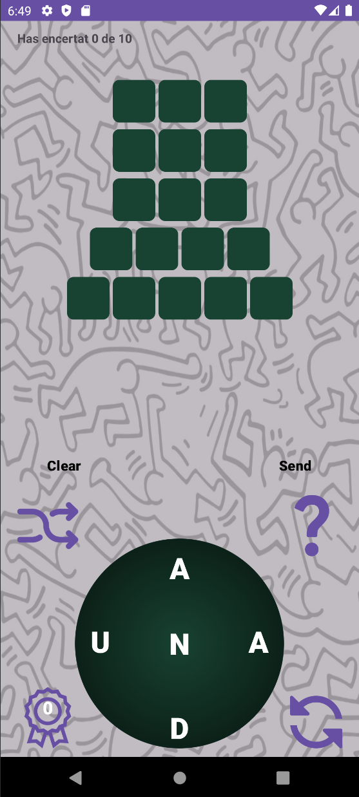
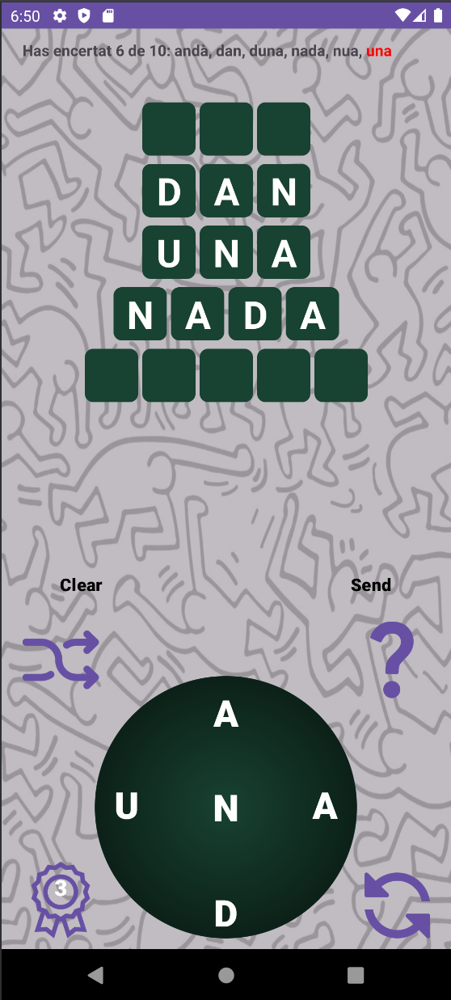
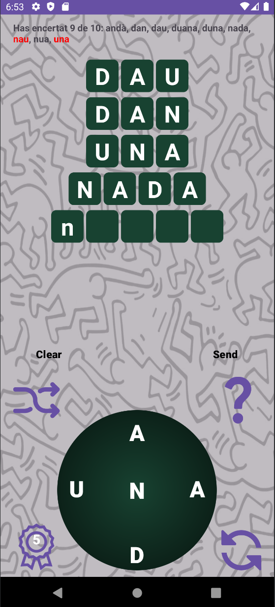
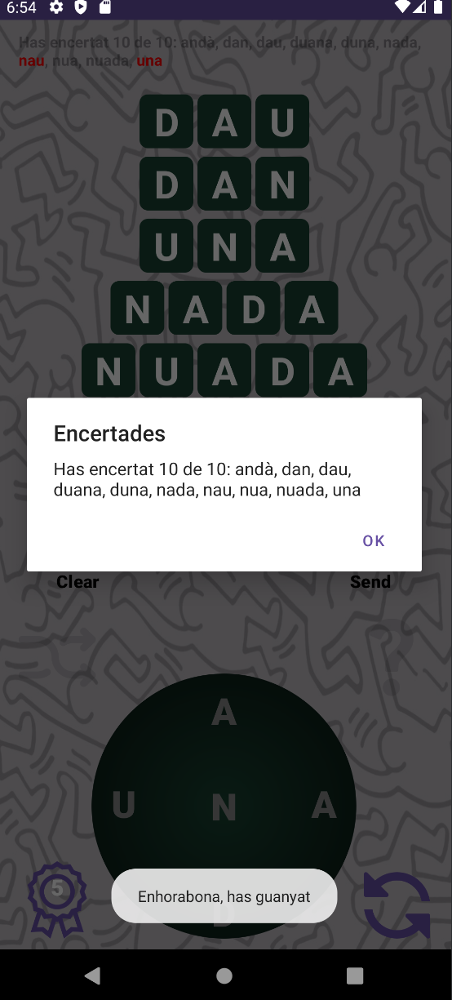

# ZenWord

## 🎮 Descripción

ZenWord es una implementación del popular juego de palabras en el que los jugadores deben formar palabras a partir de un conjunto de letras. Esta aplicación ha sido desarrollada como práctica final de la asignatura **Algorítmia y Estructura de Datos II** del plan de estudios de la **Universitat de les Illes Balears (UIB)**, centrándose en el uso de estructuras de datos como **Sets** y **Maps**.

## 📸 Capturas del Juego






## 🛠️ Tecnologías Utilizadas

- **Android Studio**: 
  - Un entorno de desarrollo integrado (IDE) basado en IntelliJ IDEA, específicamente diseñado para la creación de aplicaciones Android. Proporciona herramientas de desarrollo como un emulador, diseño de interfaces de usuario, y depuración, facilitando un flujo de trabajo eficiente.

- **Java**: 
  - Lenguaje de programación utilizado para la lógica del juego. Java es conocido por su robustez y versatilidad, lo que lo hace ideal para el desarrollo de aplicaciones Android. 

- **Estructuras de Datos**:
  - **Sets**: Utilizados para almacenar palabras sin duplicados, permitiendo búsquedas rápidas y operaciones eficientes como la verificación de existencia de una palabra.
  - **Maps**: Utilizados para asociar palabras con sus definiciones o pistas, facilitando un acceso rápido y organizado a la información.

- **Gradle**: 
  - Herramienta de automatización de compilación utilizada para gestionar las dependencias y construir el proyecto de forma eficiente.

- **XML**:
  - Lenguaje de marcado utilizado para definir la interfaz de usuario en Android, permitiendo una separación clara entre la lógica del código y el diseño visual de la aplicación.

## 📚 Aprendizajes

- **Implementación de Sets y Maps**:
  - Aprendí a utilizar estructuras de datos eficientes para gestionar palabras y pistas, lo que mejora la velocidad de búsqueda y reduce el uso de memoria. Esto incluye técnicas para agregar, eliminar y verificar elementos en estas colecciones.

- **Desarrollo de Juegos en Android**:
  - Gané experiencia en el ciclo de vida de las aplicaciones Android, desde la creación de la interfaz hasta la lógica del juego. Aprendí a manejar eventos de usuario y a actualizar la interfaz de manera fluida.

- **Optimización del Rendimiento**:
  - Implementé algoritmos para optimizar el tiempo de ejecución y el uso de memoria, lo que incluye técnicas para evitar redundancias y mejorar la eficiencia en la gestión de recursos.

- **Interacción del Usuario**:
  - Diseñé una interfaz intuitiva que permite a los usuarios interactuar con el juego de manera eficiente. Aprendí a recibir y manejar entradas del usuario, así como a proporcionar retroalimentación inmediata.

- **Trabajo en Equipo y Colaboración**:
  - A través de la documentación y el uso de Git para el control de versiones, mejoré mis habilidades de colaboración y aprendí a gestionar el código en un entorno de desarrollo en equipo.

## 📥 Instalación

1. Clona el repositorio:

   ```bash
   git clone https://github.com/DavidVazquezRivas/zenword.git
   ```

2. Abre el proyecto en Android Studio.
3. Ejecuta el proyecto en un emulador o dispositivo Android.

## 🕹️ Cómo Jugar

1. **Iniciar el Juego**: Al abrir la aplicación, se generará una pantalla principal con un círculo de letras y un número de palabras ocultas que deberás adivinar.

2. **Seleccionar Letras**: Toca las letras en el círculo para formar palabras. Estas letras se concatenarán para formar una palabra que aparecerá en el campo de entrada.

3. **Enviar Palabra**: Cuando estés listo, presiona el botón **Send** para enviar la palabra. Si la palabra es una de las palabras ocultas, se revelará y se añadirá a tu lista de palabras descubiertas.

4. **Comprobar Palabra**: Si la palabra es válida pero no es una de las ocultas, recibirás un mensaje de bonificación, y la palabra se añadirá a tus palabras descubiertas.

5. **Usar Ayudas**: Puedes acumular bonificaciones que te permitirán solicitar ayudas. Cada 5 palabras válidas te otorgarán una pista para revelar la primera letra de una de las palabras ocultas.

6. **Reiniciar Juego**: Si deseas jugar de nuevo, presiona el botón **Reinicia** para comenzar una nueva partida con un nuevo conjunto de palabras.

7. **Finalizar Juego**: El juego termina cuando hayas adivinado todas las palabras ocultas. Recibirás un mensaje de felicitación.

¡Diviértete desafiando tu mente!

## 📫 Contacto

Puedes contactarme en:

- [GitHub](https://github.com/DavidVazquezRivas)
- [LinkedIn](https://www.linkedin.com/in/david-v%C3%A1zquez-rivas-a75a9528b/)